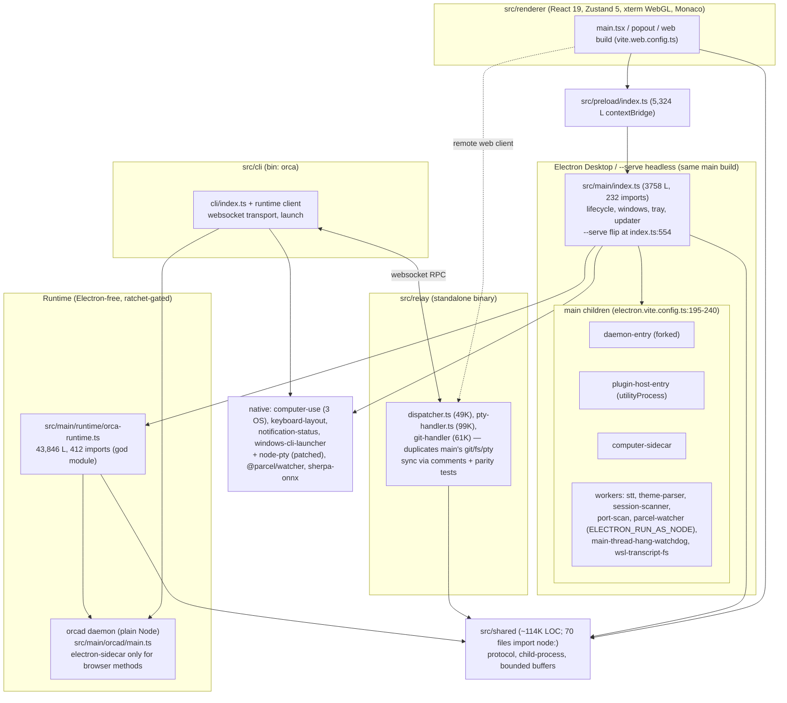

# Radical Hypotheses: Architecture, Modularity, and Electron Alternatives

Date: 2026-08-29
Status: research / discussion draft (not an intervention plan yet)
Inputs: 5 parallel codebase analyses + web research. All file refs verified by direct read.

---

## 0. Executive summary

1. **The architecture is already good.** Layer boundaries (renderer/main/shared/relay/cli) are clean by measurement: zero renderer→main imports, zero renderer→electron imports, zero shared→upward imports. The codebase already runs its headless runtime (`orcad`) on plain Node, enforced by an electron-import ratchet whose baseline is empty and must stay empty. The problem is not structure; it is (a) god files, (b) resource-lifetime discipline, (c) aggregate budgets.
2. **The single biggest modularity debt** is `src/main/runtime/orca-runtime.ts` (43,846 lines, 412 imports) and `src/main/index.ts` (3,758 lines, 232 imports). Coupling is convergent (everything wires into them), not tangled laterally.
3. **The single biggest leak class** is unbounded resource lifetimes: tab-keyed renderer maps never released (#15241), 5 copies of session scrollback (daemon + renderer), pollers that duplicate work, detached helpers never reaped (#9141). The repo already ships the primitives (bounded-map, process-tree-termination, run-process, reliability gates); adoption is the gap.
4. **No Electron alternative migration is justified in 2026.** The product's irreducible Electron needs are: windowed shell + sandboxed renderer + `<webview>`/`session`-backed browser panes. The dominant memory cost (many webviews running xterm/WebGL) is paid by any webview stack. Tauri = Rust rewrite; Electrobun = weeks-old v2; Deno Desktop is the only interesting TS-compat option but is weeks old. The highest-ROI "alternative" is already half-built in-repo: deepen the headless/daemon split and shrink the Electron shell to a thin UI host.

---

## 1. Architecture as-is

### 1.1 Process/module map (current, verified)



### 1.2 Boundary health (measured, not assumed)

| Boundary | Status | Evidence |
|---|---|---|
| renderer → main | CLEAN (0 imports) | renderer only via preload bridge |
| renderer → electron | CLEAN (0) | sandbox: true, contextIsolation: true everywhere |
| shared → upward | CLEAN (0) | — |
| shared → node builtins | SOFT VIOLATION | 70 shared files import `node:`; tsconfig.web.json includes all of src/shared; web build survives only via tree-shaking. No rule prevents renderer importing a node-typed shared module. Latent breakage. |
| relay ↔ main | DUPLICATED, not coupled | git/fs/pty handlers re-implemented in relay; sync via comment references (`src/relay/protocol.ts:1`, `git-handler-worktree-ops.ts:182`) + parity tests. Drift caught only by tests. |
| relay/cli → electron | CLEAN (0) | — |

Existing enforcement (better than most repos this size):
- `config/scripts/check-runtime-electron-ratchet.mjs`: esbuild reachability check; baseline `config/runtime-electron-baseline.txt` is EMPTY and must stay empty. Headless loads Electron zero times.
- `check-max-lines-ratchet.mjs`: grandfathered oversized files may only shrink.
- `config/reliability-gates.jsonc` (17k lines) checked in `pnpm lint`.
- Boundary-as-test ratchets: `child-process-import-boundary.test.ts` (~480 files import child_process; only 61 use run-process), cli/registry parity tests.
- Gap: no lint-layer zones; shared→node hole unenforced; no DI/event bus (fine — explicit wiring is consistent here).

### 1.3 Profiling/benchmark harness (macOS-runnable today)

| Harness | Measures | Gap |
|---|---|---|
| `bench:idle-cpu` | CPU of process tree under workloads | dev build only |
| `bench:startup` | startup latency | no budget/ratchet |
| `bench:daemon-coldstart` | orcad cold start | no headless steady-state memory bench |
| `bench:main-thread-jank` | renderer jank | — |
| `bench:hang-watchdog-memory` | RSS/footprint sampling of desktop tree | RSS only, no heap snapshots |
| terminal-perf e2e + `run-terminal-scale-perf-e2e.mjs` | 10/25/50/100 panes, budgets | CI runs ubuntu-only; no macOS CI |
| `bench:compare` | A/B artifact diff | manual, ad hoc |
| `renderer-heap-statistics-reader.ts`, `renderer-process-memory-reader.ts` | renderer→main memory reporting | not wired into any automated leak harness |

Harness gaps: (1) no `writeHeapSnapshot` automation/diff/leak attribution anywhere; (2) no headless memory benchmark (`orca serve` steady state vs ~120MB content target); (3) no packaged-release profiling workflow (all benches run `out/` dev builds); (4) no budget gates on startup/idle-CPU; (5) no macOS terminal-perf CI.

---

## 2. Bottlenecks per architectural box

(Severity × isolation-effort ranked; full evidence tables in the lane reports, condensed here.)

### High severity
| Box | Bottleneck | Evidence | Isolation |
|---|---|---|---|
| renderer | Tab-keyed module maps never released on close (10 registries; #15241 → 3.4GB RSS) | plans/03; `terminal-tab-close.ts:99-115` hand-scrubs ~15 keys | M |
| daemon | Full `HeadlessEmulator` per session pinned forever; scrollback exists in 5 copies (in-mem grid, pending, cold-restore cache, disk checkpoint, renderer xterm) | #12728; plans/04/05; `terminal-host.ts:178`, `session-output-plane.ts:16,49` | M |
| main | No aggregate session admission budget; 6 independent caps multiply | #16211 (~40GB on 16GB host), #11218; plans/04 | M |
| cross | Spawn-site discipline: 3 parallel kill stacks; raw `.kill()` orphans grandchildren; detached helpers dropped (#9141: ~200 orphaned helpers/3h) | plans/02; `macos-native-provider-transport.ts:117-129` | M |
| main | `orca-runtime.ts` god module: timers, federation maps, waiter pollers in one 43.8k-line file; repo's own churn probe targets it | `main-thread-churn-probe.ts:161` | L |
| native seam | Windows native process table lacks commit/pagefile bytes → slow PowerShell collector still runs every ~2s | #16905; plans/07 | S |

### Medium severity
| Box | Bottleneck | Evidence | Isolation |
|---|---|---|---|
| main | ~10 independent setInterval pollers (relay liveness, heartbeats, backlog probe, SSH health, worktree dir poller...) duplicating work | `desktop-relay-service.ts:317`, `ssh-channel-multiplexer.ts:576`, `worktree-base-directory-poller.ts:308` | M |
| renderer | ~15+ setInterval pollers; unbounded terminal error accumulator (fix #15306 unmerged) | plans/06; #15241 | S |
| shared | ~10 hand-rolled bounded buffers + 115 `slice(-N)` sites beside the existing `bounded-map.ts` | plans/06 | M |
| shared | 36+ `opendir` sites, 5 guaranteed-close; async generators suspend handles until GC (#12895) | plans/01 | S |
| preload | Single 5,324-line bridge; per-RPC host-memory sweeps with no TTL cache | `diagnostics.ts:8`; `process-table-snapshot.ts:69` shows the dedup pattern | S |
| daemon | Stale daemon generations never reaped | #9138 | M |

### Interference seams (where boxes hurt each other)
1. native↔PowerShell seam (missing field keeps slow path alive)
2. daemon↔renderer copy seam (scrollback ×5, only daemon side budgeted)
3. tab lifecycle seam (no central tab-destroyed event → renderer registries leak)
4. spawn↔teardown seam (no registry linking spawn sites to kill stacks)
5. convention↔guardrail seam (rules live in AGENTS.md/tests, not lint/gates → regressions recur)

---

## 3. Hypothesis 1: modularity ceiling + highest-ROI immediate changes

**Verdict: the app is already ~80% modular by measurement.** The realistic ceiling without breaking change economics:
- Achievable now (lint/config, weeks): formalize layer zones; close shared→node hole; type-contract relay/main duplication.
- Achievable incrementally (months, mechanical): shrink god files using the existing shrink-only ratchet as the net.
- Not worth it: pnpm workspaces split, DI containers, event buses. Explicit wiring + ~6.9k test files make these net-negative.

Immediate moves, ranked by ROI / disruption (all logic-preserving):

| # | Change | Effort | PR shape |
|---|---|---|---|
| 1 | Split `shared` into `shared` (isomorphic) + `shared-node`; exclude node-typed code from `tsconfig.web.json`; add oxlint `no-restricted-imports` zone | M | config + ~20 file moves; closes the one real hole |
| 2 | Enforce layer zones in oxlint (renderer→shared only; relay→shared only; nothing imports main) — codify what is already true | S | config-only |
| 3 | Extract the relay/main git+fs+pty contract into shared types (kill comment-based sync) | M | type moves + deleting duplicate validators |
| 4 | Decompose `main/index.ts` into `src/main/startup/wire-*.ts` composition modules | S–M | pure moves |
| 5 | Continue `orca-runtime.ts` extraction along named seams (PTY handle registry, waiter sets, layout state), ratchet-enforced shrink | L | multi-PR, mechanical, 100+ colocated tests as net |

Guardrail additions to catch future issues earlier (fits existing reliability-gates machinery):
- gate: no new `setInterval` pollers without an owner module + teardown registration (lint rule + allowlist ratchet, same pattern as our no-raw-opendir rule)
- gate: module-level `new Map` must be `BoundedMap` or registered in a tab-scoped cleanup registry (extend plans/03)
- gate: headless memory benchmark in CI (fills harness gap; budgets on `orca serve` steady-state RSS)
- gate: macOS terminal-perf job (today ubuntu-only)

---

## 4. Hypothesis 2: Electron dependency assessment + alternatives

### 4.1 What the product truly needs from Electron
Product: parallel-agentic-dev IDE — terminals, worktrees, embedded browser panes, mobile/relay companion.

Irreducible (desktop): `BrowserWindow` + sandboxed renderer + `<webview>`/`session` partitions (embedded browser UX) + ipcMain/contextBridge bridge + node-pty/native addons (Node side, not Electron-specific).

Incidental (individually replaceable): tray, menus, dialog, notifications, clipboard, powerMonitor, nativeTheme, screen, systemPreferences, protocol schemes, crashReporter, autoUpdater (product feature, nontrivial).

Headless today: remarkably clean. `orca serve` runtime is Electron-zero (empty ratchet baseline); desktop capabilities injected via `src/main/host/` ports (electron-secret-store, electron-http-client, etc.) with Node implementations for orcad. Remaining cost: on headless Linux the packaged app still boots the Electron binary + Xvfb + ~30 GUI libs — an artifact of the serve entrypoint, not a code dependency. A pure-Node serve entry would delete the Xvfb/GTK stack entirely.

Renderer weight: React 19 + Zustand + Monaco + xterm.js (WebGL). Fully sandboxed, Electron-agnostic except the preload bridge and `<webview>` tags — portable to any Chromium host with an IPC shim.

### 4.2 Alternatives (2026 state)

| Option | Stack change | TS reuse | Memory vs Electron | Verdict |
|---|---|---|---|---|
| Tauri 2.x (2.11.5) | Rust core mandatory; Node layer → Rust or sidecars | ~40-50% | bundle 2-10MB; RAM lower only if Node layer eliminated | Rejected: rewrite of entire native layer (pty/ssh/process inspection); multiwebview-per-window still weak vs Electron `<webview>` |
| Deno Desktop (2.9, new) | Node→Deno; Electron-like BrowserWindow, in-process bindings | ~80-90% | ~40MB (webview) / ~150MB (CEF) | Only genuinely interesting option: Node compat high, npm works, native addons work with `--allow-ffi`. But shipped weeks/months ago; no Windows auto-update/notarization; patched node-pty needs revalidation. Re-evaluate in ~12 months. |
| Electron + `bun --compile` sidecar | none (packaging only) | ~95%+ | modest (disk/startup, not the webview RAM) | Cheap experiment; orca already has `build:orcad` + prebuilds — this is half-built architecture. Caveat: `.node` addons ship alongside, patched node-pty needs Bun compat testing. |
| Electrobun 2.0 | new framework | ~70% | 1.28MB hello-world (vendor figure) | Rejected: v2 shipped weeks ago; native addon story unverified for node-pty; immature signing/update tooling |
| Neutralino / NW.js / Wails v3 (beta) | full rewrites | low-med | small | Rejected: no Node ecosystem (Neutralino), Go rewrite (Wails), legacy (NW.js) |

Key economic fact: orca's footprint is dominated by many webviews running xterm/WebGL — any webview stack pays per-window; with CEF backends (Deno/Electrobun+CEF) bundle lands at ~150MB, same as Electron. Framework migration buys little where the cost actually is.

### 4.3 Recommendation
Stay on Electron. The highest-ROI "alternative" is the in-repo trajectory: deepen the daemon/headless split so Electron shrinks to a thin UI host over an Electron-free runtime (already ratchet-protected), optionally experiment with `bun --compile` packaging of the daemon. This captures most resource/architecture benefits, zero product risk, keeps Deno Desktop as a real option in 12 months.

---

## 5. Verification (gap-finding + adversarial review, 2026-08-29)

The two independent reviews (spot-verified against source) materially revised the resource assessment. Corrections:

### Claims that broke
1. **"Drop store scrollback while mounted" (~5-20MB)**: `pendingColdRestoreByPtyId` (`terminal-state.ts:114-120`) has **no writers anywhere** — the map is always empty; the real cold-restore path goes via `pty-transport-types.ts:96`. Meanwhile the *replayed* scrollback copy is already released while mounted (`replayed-scrollback-store-release.ts`, consumed at `use-terminal-pane-lifecycle.ts:132`). The win is fiction; the leftover is a trivial dead-code-removal PR.
2. **"Dynamic-import orca-runtime out of index.ts (~20-40MB)"**: defers RSS, doesn't save it — main is long-lived and needs the runtime at startup. The only real version is moving work to the daemon-entry (already half-built), which shifts RSS between processes.
3. **"Restorable retention 10,000 → 100-500"**: misattributed constant. The real retention caps are 4 worktrees / 6 tabs hot-retain + TTLs (`terminal-hidden-view-parking.ts:16-21`, `terminal-hidden-worktree-retention.ts:25-26`) — already aggressive.
4. **"Dev build is 50-100MB higher"**: **DISPROVEN BY MEASUREMENT** — the user's ~600MB readings (renderer ~350MB, main ~150MB) come from the **release app**, not a dev build. The dev-build confound does not exist; the waste is real product memory. The in-repo anchor (`terminal-parked-memory.spec.ts:409`, ~453MB dev renderer baseline) is therefore not directly comparable to release. What survives is the harness gap itself: no packaged-release profiling workflow exists, so release-only memory regressions are invisible to CI, and the release numbers users see (the ones that matter) are never tracked.

### Claims overstated
- **WebGL cap**: already implemented — `MAX_RETAINED_HIDDEN_WEBGL_CONTEXTS = 6` with LRU eviction and `WEBGL_lose_context` release (`terminal-webgl-hidden-retention.ts:6-25`), Blink ceiling raised to 128 (`configure-process.ts:294`). The 20-50MB/context figure is folklore; realistic is ~5-25MB and dominated by the shared glyph atlas. User setting `terminalGpuAcceleration` already exists. DOM fallback for hot panes contradicts README's "Ghostty-class WebGL" positioning.
- **Scrollback 5000→2000**: repo's own measurement is **~2.5MB V8 heap per pane at 5k rows** (`terminal-hidden-worktree-retention.ts:15`; ~19MB at 50k). So the cut saves ~1.5MB/pane. Presets are a user-facing settings surface; backlog cap scales with scrollback. Product discussion, not a small PR.
- **Floor arithmetic**: the ~400MB target omits the **GPU process entirely** (60-150MB on macOS; orca carries a full gpu-crash-fallback subsystem). If the daemon alone can be 300-400MB (#12728), a 400MB *total* floor needs plan-05 dehydration to land. Floors are asserted, not derived.

### What the reviews surfaced as genuinely new
- **GPU process** absent from all accounting.
- **Per-webview 250ms URL-sync interval** (`use-browser-page-webview-url-sync.ts:156`) — runs while any browser pane is open, even idle. Real idle-CPU item.
- **Session partition proliferation**: `persist:orca-default/-local/-remote` + per-profile partitions, each with its own in-RAM networking stack — never analyzed disk vs RAM.
- **SQLite orchestration DB** (`src/main/sqlite/sync-database.ts`) resident in main's RSS — missing from the main-process inventory.
- Renderer tests import main directly (e.g. `worktree-name-suggestions.test.ts:2`) — "0 renderer→main imports" is a production-graph fact, not a structural guarantee.
- `terminal-cold-park-reveal-bench.mjs` asserts **no reveal budget** — nothing would catch a reveal regression from any parking change.

### Revised win ranking (survival × savings)
| Rank | Win | Frame |
|---|---|---|
| 1 | Lazy Monaco setup + 5 workers out of boot graph (`monaco-setup.ts:1-9`) | memory, ~30-60MB, invisible to user |
| 2 | Visibility-gate the 31 renderer setIntervals (incl. the 250ms webview URL-sync) | CPU |
| 3 | Kill/reframe 250ms backlog probe → event-driven | CPU |
| 4 | fs.watch for 2s worktree poller (watch folder-workspace regression) | CPU |
| 5 | Dead-code: remove writer-less `pendingColdRestoreByPtyId` | hygiene |
| — | WebGL cap, scrollback default, dynamic-import runtime, retention cut, federation timers | dropped/demoted (see above); federation consolidation folds into orca-runtime extraction (L) |

Maintainer-rejection forecast: (3) scrollback and (2) WebGL near-certain reject (product constants with deliberate commented policy + 162 scrollback-touching test files); items 1-4 above accept-likely with data.

## 6. Synthesis: the radical-but-acceptable architecture

The through-line of both hypotheses is the same endpoint the repo is already pointed at:

```
┌────────────────────────────────────────────────┐
│ Electron thin shell (UI host only)             │
│  windows, webviews, preload bridge             │
└──────────────┬─────────────────────────────────┘
               │ host ports (src/main/host/)
┌──────────────▼─────────────────────────────────┐
│ Runtime core (Electron-free, ratchet-gated)    │
│  sessions, PTY, git, fs, budgets               │
│  single scheduler for all pollers              │
│  aggregate session admission budget            │
└───┬──────────────────┬─────────────────────────┘
    │                  │
┌───▼────┐      ┌──────▼──────────┐
│ orcad  │      │ relay + web     │
│ daemon │      │ (already exists)│
└────────┘      └─────────────────┘
```

What changes vs today (nothing structural, only depth):
1. Move the `--serve` entrypoint to pure Node (kill Xvfb requirement on Linux).
2. One poller scheduler in the runtime instead of ~25 scattered `setInterval`s (main + renderer).
3. Aggregate session admission budget (plans/04) + dehydrate-on-idle (plans/05) → 5 scrollback copies → 1-2.
4. Tab-destroyed lifecycle event → renderer registries become enforceably bounded (plans/03).
5. Lint zones + gates (section 3) make the above monotonic and regression-proof.

Sequencing stays consistent with the contribution norms: issue-first, small PRs. Sections 3 (#1, #2) and the harness gaps (headless memory bench, macOS perf CI) are the new, immediately actionable items this research adds beyond plans/00-08.
